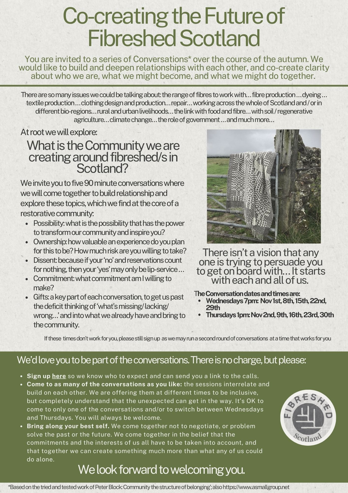

At root we will explore: _What is the Community we are creating around fibreshed/s in Scotland?_

We invite you to five 90 minute conversations where we will come together to build relationship and explore these topics, which we find at the core of a restorative community:

* **Possibility**: what is the possibility that has the power to transform our community and inspire you?
* **Ownership**: how valuable an experience do you plan for this to be? How much risk are you willing to take?
* **Dissent**: because if your 'no' and reservations count for nothing, then your yes' may only be lip-service…
* **Commitment**: what commitment am I willing to make?
* **Gifts**: a key part of each conversation, to get us past the deficit thinking of what's missing/lacking/wrong... and into what we already have and bring to the community.

Sign up [here](https://docs.google.com/forms/d/e/1FAIpQLScxSE0yalJNfhRvCrBC9AB-8sITayuPwjLJWg5Rmcir8gvjwA/viewform) so we know who to expect and can send you a link to the calls. 

