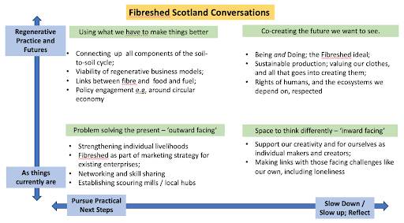

_Kate Dyer, Conversations Host_

We’ve had some wonderful, insightful and very personal conversations over the course of the last month, and I’d like to offer some reflections on their implications.  

At the outset, I’d like to reiterate my **thanks to everyone who came along** - those who came for one meeting, and those who came to all.  It’s sometimes said that ‘whoever comes are the right people’, and that was my strong sense throughout.  A small group with a rich conversation is worth much more than a larger group with some of us only semi-engaged. 

I’m also aware that **these Conversations didn’t work for everyone**.  Ninety minutes out of a busy day, or in the heart of the evening is not a possibility for everyone, and several people wrote with apologies when they missed a week as ‘life got in the way’. 

**Underlying this is in part our different orientations**, which I’ve attempted to illustrate in the chart below.  Apologies in advance to those who find ways forwards through blurred lines and porous boundaries - I’m also one of those but can find value in some delineations as the start to a clearer conversation. 

There are two spectrums here, which capture different orientations we may share or share part of: 

* from an enthusiasm for practical next steps through to valuing slowing down and taking time for reflection
* From an orientation to the world as it currently is, through to a focus on regenerative practices and futures as they could be. 

Putting these into a graph creates four possible ways forwards: 

* **Facing outwards to address immediate, obvious and practical challenges** - this might include steps we could take to organise Fibreshed Scotland for better networking and skill sharing amongst ourselves (Bottom left)
* **Slowing down to face inwards on ourselves as individuals**, including the sources of our creativity (Bottom right)
* **Using differently the skills and resources we currently have** / or can network to find to focus on what a regenerative future might look like. A wonderful practical example is the proposed flax seed library under development with ‘seed’ funding from Fibreshed International (Top left)
* **Arguably the ‘north star’ to which our work hopefully contributes**… always a work in progress but wonderful to have that orientation and vision. (Top right)

_Do any of these appeal to you more than any others?_ The Conversations as a whole are intended to nudge us towards the top right part of this diagram - slowing down and considering what kind of regenerative practices and futures we might co-create together.  

However, **it will take all of us** - including those who are oriented to practical problem solving in the current context we’re living and working in. 

We are hoping to build on the momentum and interest we’ve created by meeting to discuss ‘Next Steps’ on **Thursday 7th December 11.30-1.30.** We’re intending to shape up what we do and how we do it, hence our agenda will cover:

* Our material focus (wool/linen/hemp etc - through all the stages from farm to production and markets and ultimately back to soil)
* Linking up with Fibreshed International
* Regionality within Scotland
* How we organise ourselves (our core team, communications, meet-ups and so on) 

Please let us know at fibreshedscotland@gmail.com if you’d like to come along and we’ll send you the link. 
